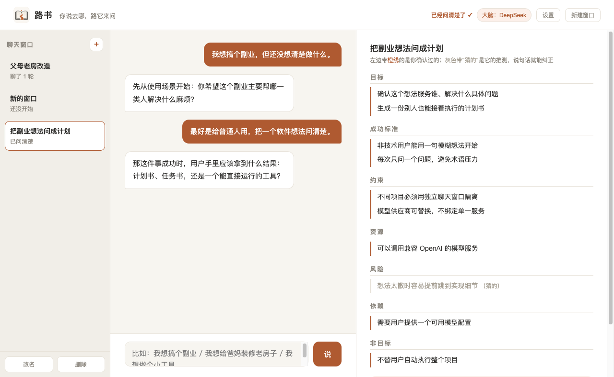
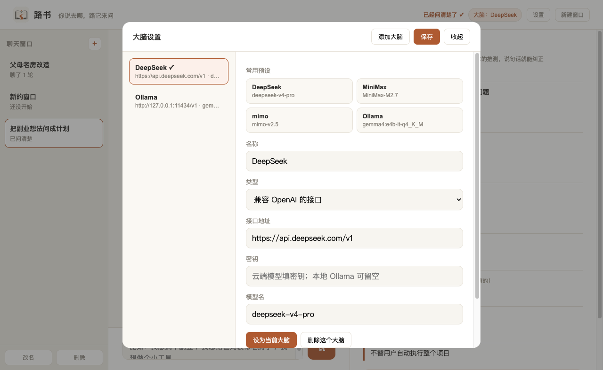

<p align="center">
  
</p>

# 路书 / Routebook

你说去哪，路它来问。  
Say where you want to go. Routebook asks the way.

**路书（Routebook）** 是一个给普通人的反问式计划工具。你不需要懂技术，也不需要先写需求文档；只要用一句模糊的话开头，路书会一次只问一个问题，把想法澄清成右侧实时生长的文档，最后生成一份可执行的计划书。遇到软件类想法，它还可以生成一份“给 AI 编程工具的任务书”，交给 Codex、Kiro、Cursor、DeepSeek、通义灵码或其他工具继续实施。

路书是领航员，不是车队。它不替你执行项目，不绑定某一个模型供应商，也不试图变成复杂的本地模型平台。它只做一件事：把“我大概想做点什么”问成一条别人也能接着走的路。



## 功能亮点

- 一次只问一个问题，避免把普通人淹没在术语里
- 右侧实时沉淀“意图骨架”，区分“已确认”和“推测”
- 支持生成计划书，以及软件类想法的 AI 任务书
- 多聊天窗口隔离：每个项目、想法、上下文互不污染
- 支持中文、English、日本語、한국어
- 支持 DeepSeek、MiniMax、mimo、Ollama 等兼容 OpenAI 的模型服务
- 桌面安装版优先，不要求普通用户手动管理端口
- 数据保存在本机，可导出备份

## 适合谁

路书适合“有想法，但还没想清楚”的人：

- 想把副业、产品、生活计划问成清晰路线
- 想让不懂技术的人也能产出软件任务书
- 想把不同项目放在不同窗口里，不让上下文互相污染
- 想使用自己选择的模型服务，而不是被默认供应商锁死

它暂时不适合：

- 自动替你执行项目
- 管理大量模型和推理资源
- 做团队级项目管理或长期记忆数据库

## 安装

从 [Releases](https://github.com/strmforge/Routebook/releases) 下载对应系统的安装包：

- Windows：`Routebook-Setup-0.1.0.exe`
- macOS Apple Silicon：`Routebook-0.1.0-arm64.dmg`
- macOS Intel：`Routebook-0.1.0-x64.dmg`
- Linux x64：`Routebook-0.1.0-x86_64.AppImage`
- Linux arm64：`Routebook-0.1.0-arm64.AppImage`

开源版默认不做代码签名。第一次打开时，系统可能会提醒这是来自互联网或未知开发者的应用：

- macOS：右键应用选择“打开”，或在系统设置里允许打开
- Windows：SmartScreen 可能提示风险，确认来源后选择“仍要运行”
- Linux：AppImage 可能需要先加执行权限，例如 `chmod +x Routebook*.AppImage`

## 添加模型

第一次打开路书，点右上角“模型”，选择预设，再填密钥即可。



内置预设：

- DeepSeek：`https://api.deepseek.com/v1`
- MiniMax：`https://api.minimaxi.com/v1`
- mimo：`https://token-plan-cn.xiaomimimo.com/v1`
- Ollama：`http://127.0.0.1:11434/v1`

云端模型需要密钥。本机或局域网 Ollama 可以留空密钥。路书只要求服务兼容 OpenAI 的 `/chat/completions` 接口，不保留 Claude 默认项。

旧配置仍兼容：把 `config.example.json` 复制为 `config.json` 后填写，也会被识别成一个模型配置。开源发布时不要提交 `config.json`、`models.json` 或 `windows/` 数据目录。

## 多窗口隔离

每个想法都可以开一个独立聊天窗口。每个窗口都有自己的：

- 聊天记录
- 意图骨架
- 计划书
- 给 AI 的任务书

窗口名只给人看，真正的隔离边界是 `windowKey`。发送消息、生成计划书、生成任务书都必须带明确的 `windowKey`。缺少 `windowKey` 或窗口不存在时，后端会拒绝请求，不会默认落到最近窗口。

## 数据和备份

安装版默认把数据放在应用的用户数据目录里。浏览器开发版默认放在项目目录里，除非设置 `LUSHU_CONFIG_DIR`。

主要文件：

- `models.json`：模型列表和密钥
- `windows/index.json`：窗口索引
- `windows/<windowKey>.json`：单个窗口的聊天记录和文档

设置页的“导出备份”只导出聊天窗口、计划书和任务书，不导出模型密钥。

## 开发运行

```bash
npm install
npm run desktop
```

浏览器版：

```bash
npm start
```

打包：

```bash
npm run dist
```

只生成可运行目录：

```bash
npm run pack
```

## 测试

```bash
npm run smoke
npm audit --audit-level=high
node --check server.js
node --check desktop/main.js
node --check desktop/preload.js
node --check scripts/capture-screenshots.js
```

冒烟测试使用临时数据目录，不会污染真实数据。它覆盖模型配置保存、密钥可空调用、多窗口隔离、计划书/任务书生成和备份导出。

刷新 README 截图：

```bash
npx electron scripts/capture-screenshots.js
```

## 设计原则

1. 一次只问一个问题。
2. 禁止术语，取舍要翻译成生活后果。
3. 聊天是输入，文档是真相。
4. 窗口必须隔离，显示名不能当边界。
5. 软件类任务书必须自足，没参与对话的人拿到也能动手。
6. 支持多个模型供应商，但不把用户锁进某个供应商。
7. 本地 Ollama 是开放性证明和高级选项，不是普通用户主线。
8. 安装版优先，普通人不应该被端口、命令和开发环境挡在门外。

## Wiki

仓库 Wiki 初稿放在 [`docs/wiki`](docs/wiki)。发布到 GitHub Wiki 时，可以把这些 Markdown 文件复制过去：

- [Home](docs/wiki/Home.md)
- [Getting Started](docs/wiki/Getting-Started.md)
- [Model Setup](docs/wiki/Model-Setup.md)
- [Window Isolation](docs/wiki/Window-Isolation.md)
- [Data and Backup](docs/wiki/Data-and-Backup.md)
- [Release Checklist](docs/wiki/Release-Checklist.md)

## License

MIT License. See [LICENSE](LICENSE).

---

# Routebook

Routebook is a question-first planning app for people who have ideas but do not write code.

Start with one rough sentence. Routebook asks one plain-language question at a time, turns the conversation into a living intent document, and eventually writes a practical plan. For software ideas, it can also write a self-contained task brief that you can paste into any AI coding tool.

Routebook is a navigator, not the convoy. It does not execute the project for you, does not lock you into one model vendor, and does not try to become a local-model control center. Its job is to clarify the route so another person or tool can continue with less confusion.

## Highlights

- One question at a time
- Plain-language tradeoffs instead of technical jargon
- Live intent document with confirmed items and guesses
- Plan generation plus AI coding task briefs
- Isolated chat windows for separate projects
- Chinese, English, Japanese, and Korean UI
- OpenAI-compatible model providers, including local Ollama
- Local data with exportable backups
- Desktop packaging for Windows, macOS, and Linux

## Install

Download a build from [Releases](https://github.com/strmforge/Routebook/releases).

Unsigned open-source builds may trigger OS warnings. This is expected for the current community release:

- macOS: right-click and choose Open, or allow the app in System Settings
- Windows: SmartScreen may require choosing Run anyway
- Linux: make the AppImage executable if needed

## Development

```bash
npm install
npm run desktop
```

Run the browser server:

```bash
npm start
```

Build release artifacts:

```bash
npm run dist
```

Run checks:

```bash
npm run smoke
npm audit --audit-level=high
```

## Model Setup

Routebook uses OpenAI-compatible chat completion APIs. Cloud models normally require an API key. Local Ollama can leave the key blank.

Built-in presets include DeepSeek, MiniMax, mimo, and Ollama. Claude is not retained as a default in the open-source build.

## Data

Routebook stores model settings and window data locally. Backups exported from Settings include chat windows, plans, and task briefs, but not model API keys.

## Project Status

This is an early open-source desktop release. The main goal is to make idea clarification usable for non-technical people before expanding features.
